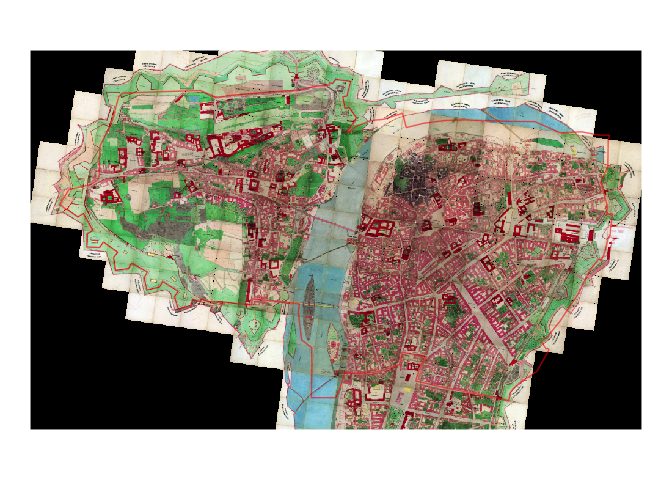

<!-- README.md is generated from README.Rmd. Please edit that file -->

# pragr <a href='https:/petrbouchal.github.io/pragr'></a>

# pragr: use Prague geodata in R

<!-- badges: start -->

[](https://www.tidyverse.org/lifecycle/#experimental)
[](https://travis-ci.org/petrbouchal/pragr)
<!-- badges: end -->

📦 `pragr` aims to provide tools for visualising data about Prague.
Currently, it makes Prague raster geodata accessible for use in R via 📦
`ggplot2`.

## Installation

You can install the current version of pragr from GitHub with:

``` r
remotes::install_github("petrbouchal/pragr")
```

## What it does

Currently, the 📦 enables you to do two things:

1)  Add raster tiles from the Prague geoportal to a `ggplot2` object
    (`prg_tile()`)
2)  Add other raster layer to a `ggplot2` object (`prg_basemap()`)

The basic logic of these two functions is that given a simple feature
dataset, they provide the tiles or image to create the base map for
those coordinates.

It relies on the REST API of ArcGis map/image services that power the
geoportal:

, using documentation for the following operations (endpoints): [Image
Tile
endpoint](https://developers.arcgis.com/rest/services-reference/image-tile.htm)
- [Export Image
endoint](https://developers.arcgis.com/rest/services-reference/export-image.htm)
- [Export Map (image)
endpoint](https://developers.arcgis.com/rest/services-reference/export-map.htm)

The approach draws heavily on code provided by
@[yutannihilation](https://github.com/yutannihilation) in her islog
post\](<https://yutani.rbind.io/post/2018-06-09-plot-osm-tiles/>) on
using OpenStreetMap tiles in 📦 `ggplot2`.

The approach should be generalisable to other ArcGis-driven servers with
the same REST API, though the package as it now is assumes a projected
CRS measured in meters, specifically the Krovak crs (EPSG 5514).

# Usage

``` r
library(pragr)
library(dplyr)
#> 
#> Attaching package: 'dplyr'
#> The following objects are masked from 'package:stats':
#> 
#>     filter, lag
#> The following objects are masked from 'package:base':
#> 
#>     intersect, setdiff, setequal, union
library(sf)
#> Linking to GEOS 3.6.1, GDAL 2.1.3, PROJ 4.9.3
library(ggplot2)
#> Want to understand how all the pieces fit together? See the R for
#> Data Science book: http://r4ds.had.co.nz/
#> 
#> Attaching package: 'ggplot2'
#> The following object is masked from 'package:crayon':
#> 
#>     %+%
```

``` r
praha1 <- CzechData::load_RUIAN_settlement(prg_kod, "MOMC_P", WGS84 = F) %>% 
  filter(nazev == 'Praha 1')
```

``` r
ggplot() +
  prg_tile(data = praha1, zoom = 10, alpha = .7, buffer = 200,
           tile_service = 'orto') + 
  geom_sf(data = praha1, fill = alpha("red", 0.6), colour = NA) +
  theme_void()
#> https://mpp.praha.eu/arcgis/rest/services/MAP/letecke_snimky_posledni_snimkovani_cache/ImageServer/tile/10/17098/16217
#> https://mpp.praha.eu/arcgis/rest/services/MAP/letecke_snimky_posledni_snimkovani_cache/ImageServer/tile/10/17098/16218
#> https://mpp.praha.eu/arcgis/rest/services/MAP/letecke_snimky_posledni_snimkovani_cache/ImageServer/tile/10/17098/16219
#> https://mpp.praha.eu/arcgis/rest/services/MAP/letecke_snimky_posledni_snimkovani_cache/ImageServer/tile/10/17097/16217
#> https://mpp.praha.eu/arcgis/rest/services/MAP/letecke_snimky_posledni_snimkovani_cache/ImageServer/tile/10/17097/16218
#> https://mpp.praha.eu/arcgis/rest/services/MAP/letecke_snimky_posledni_snimkovani_cache/ImageServer/tile/10/17097/16219
#> Adding alpha channel to tile image.
#> Adding alpha channel to tile image.
#> Adding alpha channel to tile image.
#> Adding alpha channel to tile image.
#> Adding alpha channel to tile image.
#> Adding alpha channel to tile image.
```


``` r
ggplot() +
  prg_basemap(data = praha1, alpha = .8, buffer = 200,
              image_service = 'archiv', layer = 6) + 
  geom_sf(data = praha1, fill = alpha("red", 0.6), colour = NA) +
  theme_void()
#> Adding alpha channel to basemap image.
```



# What’s in a name?

The name of the package refers to [Karel
Prager](https://en.wikipedia.org/wiki/Karel_Prager), a renowned Czech
modernist architect. Among other things, he designed - and for a long
time worked in - the office buildings in which the [Institute for
Planning and Development](https://iprpraha.cz), Prague’s public urban
planning body, is housed today.

The institute’s excellent data team develops and maintains the data and
software infrastructure for Prague’s geographical data on which this
package - and much of Prague’s planning, government and business -
relies.

Prag is of course how the city was once called by its many
German-speaking inhabitants.

# Data sources:

Most map/image services are accessible via
<http://www.geoportalpraha.cz/cs/clanek/22/mapove-sluzby>

A more technical route to lists of services is via

  - <https://mpp.praha.eu/arcgis/rest/services/>
  - <https://tiles.arcgis.com/tiles/SBTXIEUGWbqzUecw/arcgis/rest/services>
  - <http://mpp.iprpraha.cz/arcgis/rest/services/>

For some of the services, shortcut notation is implemented for use in
the tile/basemap functions.

## Note on geodata about Prague

# See also:

  - [CzechData](https://github.com/JanCaha/CzechData)

# TODO

Common

  - [ ] improve temp file saving so that conflicts are minimised
  - [ ] implement cache expiry (do not redownload before N days)
  - [ ] generalise image caching logic
  - [ ] merge and reorganise service spec list
  - [ ] expose list of all services via a dedicated function
  - [ ] add notes on data sources, Leaflet etc.

`prg_basemap`

  - [ ] add `verbose` parameter
  - [ ] rewrite to use JSON spec (sizing, image format)
  - [ ] allow ‘max’ as a value of the size parameter
  - [ ] implement url option for service parameter
  - [ ] make prg\_basemap resilient to JPEGs
  - [ ] check URL paramteres in base
  - [x] test alpha logic in basemap
  - [ ] implement automatic choice/choice cascade of format for base

`prg_tile`

  - [ ] add `verbose` parameter
  - [x] implement alpha in prg\_tile
  - [ ] check URL parameters in tile
  - [ ] implement automatic zooming for tiles
  - [ ] implement automatic choice/choice cascade of format for tile

Minor enhancements

  - [ ] reexport CzechData fns + data relevant to Prague
  - [ ] create CzechData wrappers for Prague (settlement, cadastre,
    registers/conversion tab les)
  - [ ] expose precise 5514 CRS
  - [ ] expose/reexport Prague codes
  - [ ] expose Prague bbox
  - [x] Prague-shaped favicon/hex icon?

# Acknowledgments

  - The approach draws heavily on code provided by
    @[yutannihilation](https://github.com/yutannihilation) in her \[blog
    post\]
  - logo designed using the 📦 bunny by
    @[dmi3kno](https://github.com/dmi3kno) following his [blog
    post](%5Bhttps://www.ddrive.no/post/making-hex-and-twittercard-with-bunny-and-magick/%5D)
  - most importantly, IPR Praha for the data\!
